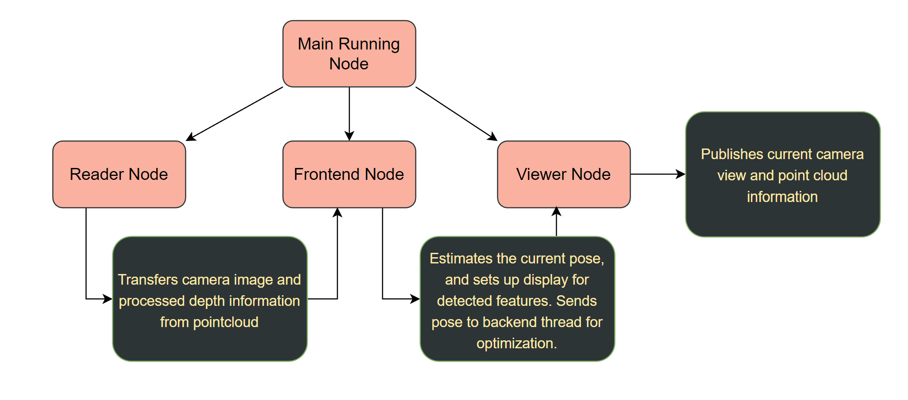
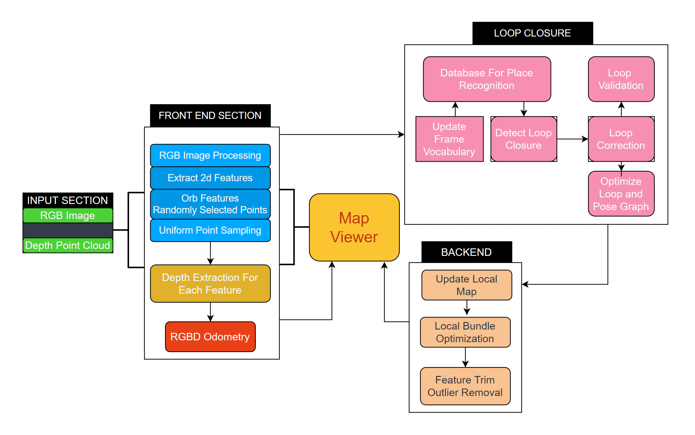
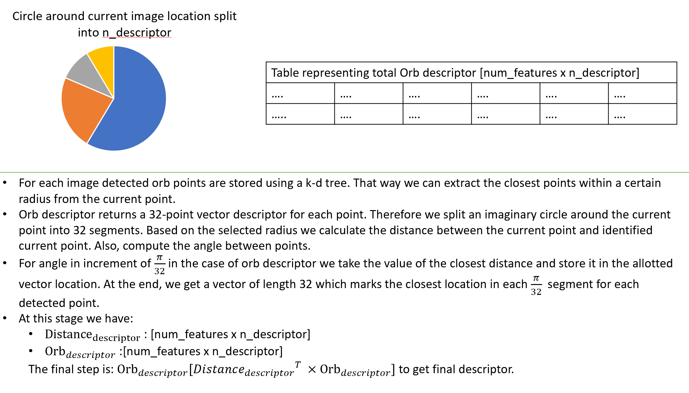

## RGB-D SLAM System

We implement a visual odometry and mapping system in an indoor space.
Here we can extract the RGB image and point cloud information to get
3d-position for each pixel in the picture. Using RGB-D reduces the
initialization issues in stereo cameras or dealing with unknown scale in
the monocular camera case. The system here does not include a remapping
stage \[loop closure\] which optimizes the entire map when a location
has occured twice.

## RGB-D Cameras

As mentioned, the RGB-D camera takes an active approach to measuring
pixel depth. The basic idea is the camera emits a light beam to the
target object. There are two main-types:

-   RGB-D sensor using structured infared light to measure pixel
    distance. Distance is measured base on returned structure of light
    pattern.
-   Measures pixel distance using time of flight. Similar to laser/sonar
    the camera emits a light pulse to the target and determines distance
    according to the beam\'s time of flight.

In comparison to other methods, RGB-D is limited to application range,
power consumption, and cost. Also, it has the greatest initial
processing time interms of feature extaction, depth calculation etc. As
an example: **During testing**, one step for stereo pose estimation
tooks about 0.05 seconds, for the RGB-D case, it took 0.1 seconds due to
image and pointcloud processing. **might be different if RGBD depth
image was used instead**. However, during testing there the topic
producing the depth image was inconsistent

<!--  -->
<div align=center></div>

## System Brief:

**Frontend Sequence:**

-   Using Orb descriptor and Randomly selected points with local
    gradient information as key points.
-   Points are filtered using Poisson Sampling to distribute identified
    points evenly. Spacing out identified key points reduced redundant
    estimation. The 3d-distance for each key point is calculated from
    the point cloud.
-   To speed up pose calculation, the Optical flow method matches
    features between sequential images.
-   Matched features are trimmed using RANSAC and InterQuartile Range to
    remove outliers and reduce the sample space.
-   If the number of tracked keypoints is lower than a thresold, it will
    detect new features and create a keyframe.

**Backend Sequence:**

-   Uses Pose Graph to estimate pose and optimize landmarks. A pose
    graph is a graph with nodes representing robot poses and edges
    linking nodes. The edges act as constraints and contain information
    like odometry measurements, image information, imu measurements, and
    generally, any data obtained within two-time frames. Through this,
    we can localize the robot and give an estimated sparse map of the
    environment. For more information, visit
    (<https://www.youtube.com/watch?v=uHbRKvD8TWg&t=7s>)

## Ros Overview:
<div align=center></div>

**Image above shows the overall workflow in Ros. The backend system is
not implemented as a node since it didn\'t use any ros components. It
operates as a singular external thread.**

## Problems with Current Method:

-   Limited Speed:
    -   Cameras cannot capture high speed motion, image becomes blurred
        and cannot extract features from it.
    -   It does not operate well in areas with low features or texture.
        So currently need to move at low speed to extract as much
        information as possible.\
-   No Loop Closure: Currently cannot perform a global map optimization
    to current previously estimated pose and landmarks.
    -   Popular loop closure method requires prior knowledge of the
        environment, and methods like Bag of words when used to describe
        and image cannot be updated real-time.

## Future Work: System Flow With Loop Closure
<div align=center></div>

As mentioned earlier, loop closure allows for global landmark and pose
estimation when a loop has been detected. A loop is detected when two
images have high similarity implying the same location has been visited
more than once. Leads to a more accurate map representation and pose
estimation. The main hindrance to the Bag of Word approach is that it
cannot be updated real-time and image matching can be really slow
depending on voabulary size. To this end I propose a new method of
describing image point locations for slam.

<!--  -->
<div align=center></div>

Following this, a combination of hastables with fixed size and cosine
similarity to calculate vector similarity can be used to calculate image
similarity. This should allow for realtime update. **More research to be done**

## Run the example
To run the project
```
1) Ensure all tools have been cmake-installed.
2) In terminal 1: ./tools/install.sh
3) In terminal 2: ./tools/robot_env.sh
4) In terminal 3: ./tools/ros_bridge.sh
5) ros2 launch my_slam vo.launch.py
3) In new terminal: ros2 run teleop_twist_keyboard teleop_twist_keyboard --ros-args --remap cmd_vel:=/robot/cmd_vel
```

## References

### Visual SLAM: From Theory to Practice (<https://github.com/gaoxiang12/slambook-en>) {#visual-slam-from-theory-to-practice-httpsgithubcomgaoxiang12slambook-en}

The section breakdowns are borrowed from Chapter 13, modified to match
the RGB-D system, and include more advanced outlier methods.

### Dependencies Used

### OpenCV

Dowload and install instructions can be found
[here](https://opencv.org/releases/). I am using OpenCV 4.5.4.

### Eigen

Can be installed using `sudo apt-get install libeigen3-dev`.

### Sophus

Dowload and install instructions can be found
[here](https://github.com/strasdat/Sophus).

### g2o

Dowload and install instructions can be found
[here](https://github.com/RainerKuemmerle/g2o).
